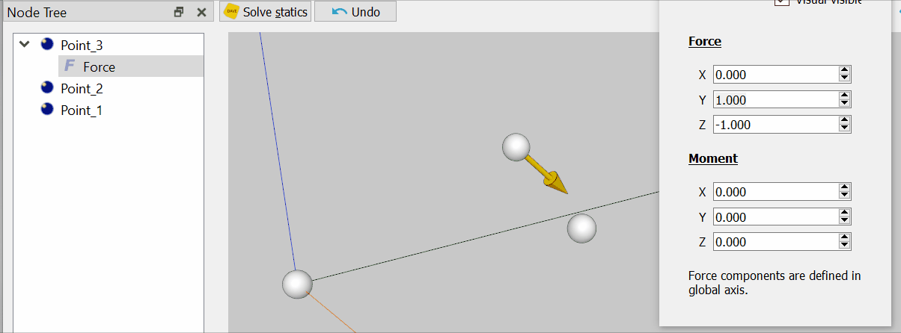
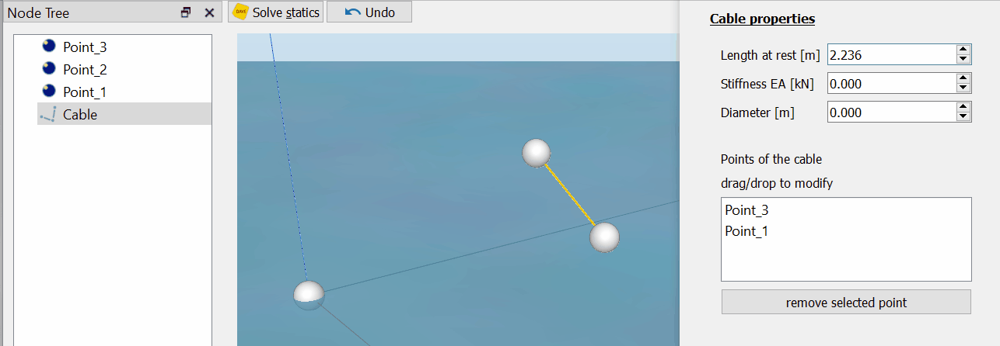

### All other nodes

With axis, points and circles all geometric features of the model have been defined. Time to start decorating.

All other nodes are attached to one or more axis, point or circle nodes. They add forces or add information (such as visuals).

Nodes that are clearly located on a geometric node (Axis, Point or Circle) have that node as parent. These types of nodes can add forces to the model depending on their parents position and or orientation.
For example the Force node applies a static force on its parent. The buoyancy shape node calcualates the submerged shape based on the position and orientation of its parent. It then applies the force and moment resulting from the displaced fluid on its parent.

Nodes can also connect geometric nodes. These nodes depend on more than one geometric feature and do not have a parent. Instead they keep a reference to the nodes that they are connected to.

The 6D, 2D and beam connectors for example connect to two axis systems and apply an equal but opposit force on both of them depending on their relative positions/orientation and the defined stiffness of the connector. The two axis systems are called Main and Secondary.

Cable nodes can connect an unlimited amount of Points and Circles via an elastic cable. Here the connected nodes are referred to as "connections".

#### Gui

Nodes with a parent are shown in the node-tree below their parent. Their parent can be changed by dragging and dropping the node onto a new parent.

Nodes without a parent are shown seperately. Their connected nodes are shown in the properties of the node. Connections can be added by dragging nodes from the tree view into the list of connections. Re-ordering the list is also done using drag and drop.

#### The big exception

Some node types are frequently used together. For example an Axis, Point and Force to model an object with a cog. For convenience these combinations have been implemented as their own type. For all practical purposes they can be treated in the same way as any other node.

*RigidBody* is a combination of and Axis, a point and a force. It can be used as Axis but adds a cog and a weight to it.

