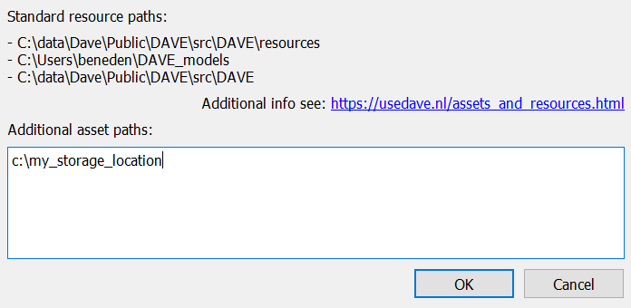
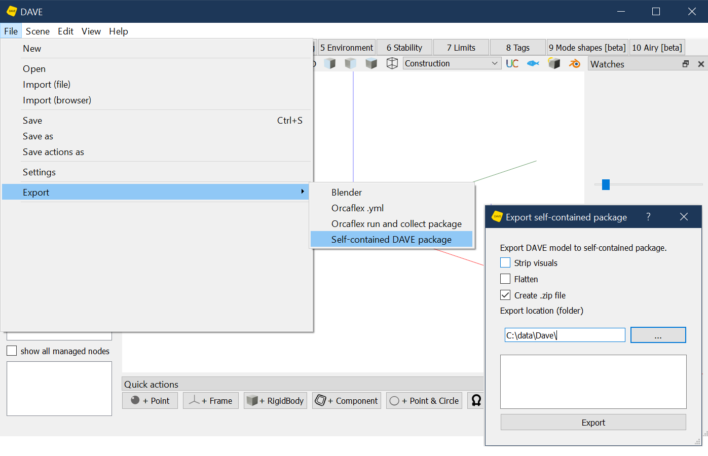
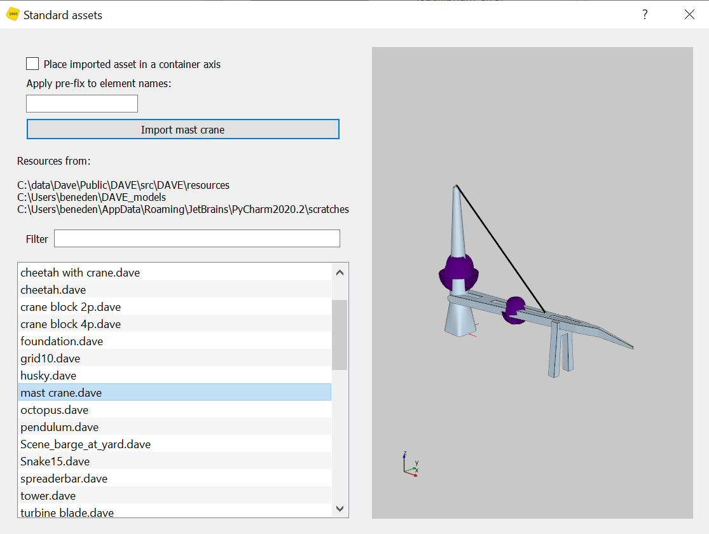

# Files and resource library

DAVE nodes can load files. Files are used for:

- Components (.dave files)
- Visuals (.obj files and .blend files)
- Buoyancy shapes (.stl / .obj files)
- Tank shapes (.stl / .obj files)
- Contact meshes (.stl / .obj files)
- Standard nodes (.csv files)
- Hydrodynamic databases (.hyd, .dhyd)

The content of these files is not stored in the DAVE model itself, they are read when the model is loaded or when the node is updated. The DAVE model only stores the location and name of the file it needs to read.

The name and location of the file ("resource") can be provided to DAVE using the full path of the file. For example: `c:\users\yourname\model.dave` . While this will work fine for you, it will give issues when sharing your model with somebody else. Therefore DAVE provides the following options to point to a file in a "standard location"

:::{tip}
`res: model.dave`  Add `res: ` in front of a filename to locate the file in the "resource" system
`cd: model.dave` Add `cd:` in front of a filename to read the file from the "current directory"

:::

The Scene object will *not* walk through sub-folders when looking for an asset or resource. This means that subfolders add to the uniqueness of the filename.
A file called `res: attempt1/box.obj` is different from a file `res: attempt2/box.obj`


## Why

DAVE is designed such that it can be used as part of a larger system in an organization. In such a system various sources for assets and resources may exist: For example a shared library with officially approved assets, an library with project assets that are still under construction, a personal folder with the items you are working on at that moment. 

In a typical workflow an asset would first be created in a local or project folder. Then it would be checked and approved. Once approved it would be moved to an official (write protected) folder from where everyone with access should be able to easily use it.

This is what the `res:` prefix is for.

On the other hand, DAVE can also be used completely separated from the rest of the world. In that case use the `cd:` prefix or just the full path.

## Standard Resources

Some default resources are included with DAVE. These include basic geometric shapes, shackles and the famous DAVE fleet. You can add your own.


## Resource system storage locations (res:)

A Scene contains a list of locations where assets and resources can be found.

In the GUI this list can be seen and extended using `file > settings` 



additional asset part are stored for the current user of the computer. They are not part of the .DAVE model. 

The standard resource paths (on top)  can not be changed in the GUI. 

The order of the list is important.
The list is considered to be ordered from most-official to least-official. So, for the default list, a resource in the `resources` subfolder of the DAVE installation is considered of higher rank than a resource with the same name in the users DAVE_assets folder.

:::{attention}

If a file with the same name exists in more than one resource location, then the location highest on the list is used.

For example `res: cube.obj` will always load cube.obj from the build-in resources folder as that is highest on the list and a file cube.obj is present there.

:::

### Changing the standard resource paths programmatically:

This list is in `Scene.resources_paths`. By default it is initialized (in `settings.py`) to

1. the `resources` subdirectory in the DAVE python source folder
2. the `DAVE_models` subdirectory in the users home folder.

:::{attention}

In custom builds of DAVE more or other default paths may have been added. A typical one is:

3. c:\data\DAVE

:::

You are free to add more locations or remove existing locations by either changing the initilization in settings.py for a system-wide change or by changing the `resources_paths` list of the current Scene object.


```{admonition} More info:
- For information about python lists see [python documentation](https://docs.python.org/3/tutorial/datastructures.html)
- Python treats backslashes "\" in strings in a special way which can result in unexpected results when you are not aware of that. For example \n means "new-line" and \t means tab. To suppress this simply place a "r" in front of the string.

```python
s = Scene()
s.resources_paths.append(r'c:\data') # append to the end of the list
s.resources_paths.insert(0, r'c:\data\copy_of_very_official_stuff') # insert at top of list
```


# Stand-alone copy

Sometimes is it needed to create a stand-alone copy of a model including all its dependencies.  Examples are when sharing the model with somebody outside the organization or storing a copy for QC requirements.

The GUI provides an option to export the current model as a stand-alone copy. In this screen you are given the following options

- Flatten: 
  - evaporates/dissolves all non-standard nodes (spreaderbars, vessels, riggingstrings, etc). This can be useful if the receiving party does not have all the custom nodes. 
- Strip visuals:
  - Visuals are not required for and do not influence the calculations. They can however be large or part of an NDA. Checking this option will export the model without  `Visual` nodes.

- zip: 
  - Compress the exported model to a .zip file



Python API:

```python
s.create_standalone_copy(target_dir=r'c:\data\test', 
                         filename = 'exported.dave',
                         include_visuals=True,
                         zip=True,
                         flatten=False)
```


# Tips for using resources to your benefit

In general:

- A good engineer is a lazy engineer (not the other way around!)
- Data duplication is bad.

DAVE supports this by enabling the re-use of models.


# Assets and resources

Assets are .DAVE files containing one or more Nodes. These are human readable python files.
Resources are all files that DAVE can use in a model. For example visuals (.obj), hydrodynamic databases but also assets (.DAVE).

## Assets

Re-usable components of a model are typically stored as asset. Assets can be imported into a scene using `import_scene` or via the Library in the Gui.



or they can be used in a `Component` node (Where to save: see {doc}`Components<components>`)

If a model contains many identical parts, it is good practice to save these parts as asset. 

```{admonition} Example:
Consider a 4 point lift with four identical pad-eyes.

Model the padeye:
- First create a single padeye.
- Then save this padeye as asset.

Model the lift:
- Create the lifted object
- Create Component node
- Set the path of the component node to the padeye asset.
- Place the component in the right position
- Duplicate the component for the other three liftpoints
- Import the hook asset.
- Model slings and shackles.
```

To avoid name conflicts assets can be imported using a pre-fix on the element names.
To enable movement and rotation of the imporeted nodes as a whole it is possible to place all imported elements in a frame (container). This means all positions and rotations are given relative to this frame. Moving and rotating this frame will move/rotate all contained nodes.

## Loading and saving resources

The path to a resource can be obtained by putting `res: ` in front of the filename. This will loop over the resources_paths **from top to bottom**. It will return the full path to the first items found. More official assets or resources take precedence over less official ones.


> `res: cube.obj` will resolve to the file cube.obj in the most-official resource folder 

If a resource with the same name is present in both the `resources` directory and the `DAVE_models` directory then a link to the one in the `resources` directory is returned as `resources` is higher in the hierarchy than `DAVE_models`.

When saving resoures the folders are evaluated from bottom to top. The first folder with write access is used to save the item. So this is exactly opposite from loading resources. **A resource is saved in the least official folder.**

It is also possible to load or save resources using the full path. In that case the whole system is circumpassed.


## Examples

Example 

```python
s = Scene()
filename = s.get_resource_path('res: buoyancy cheetah.obj')  # will return the official buoyancy cheetah.obj

s.save_asset('empty')                 # assets saved in workfolder / empty.dave
s.save_asset('subfolder/empty')       # assets saved in workfolder / subfolder / empty.dave

s.get_resource_path('empty.dave')           #  will return "workfolder / empty.dave_asset"
s.get_resource_path('subfolder/empty.dave_asset') #  will return "workfolder / subfolder / empty.dave"

s.save_asset(r'c:\data\test.abc')     # will save as c:\data\test.abs
```

## Summary

- `res:` means look-up a file with this name in the resource folders 
- `cd:` means use the file from the current directory
- Scene.resources_paths is a list of paths with locations where resources are located.
- This list can be viewed and extended via the `gui at file > settings`
- This list is ordered from Most official to Least official
- If a file with the same name exists in a more official location, then that file gets priority above a file with the same name in a less official location.
- Saving files without specifying the full path will store them in the least official folder
- The resources_paths can be edited either in settings.py or in the Scene object.
