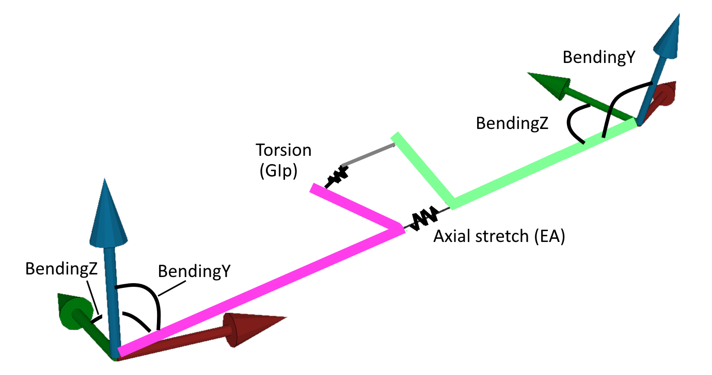

## Beams

Beams can be used to model slender and linear elastic items such as:

- beams (obviously)
- pipes
- wires
- chains
- catenaries

Beams may have a mass, bending stiffness, torsional stiffness and axial stifness. Beams can be placed between axis nodes.

A beam node consists of a number of beam segments. Each of these segments has torsion and axis springs at its center and bending springs at its ends:

### Not a typical FEM (Euler / Bernouilli) beams

Users of FEM packages may wonder why a beam element in DAVE is not equal to the typical Bernouilli-Euler beam element this is found in many FEM packages. The reason for that is that FEM packages assume small displacements where DAVE does not. The small displacements assumption allow FEM packages to simplify the bending of a beam as the second derivative of the shape function. 