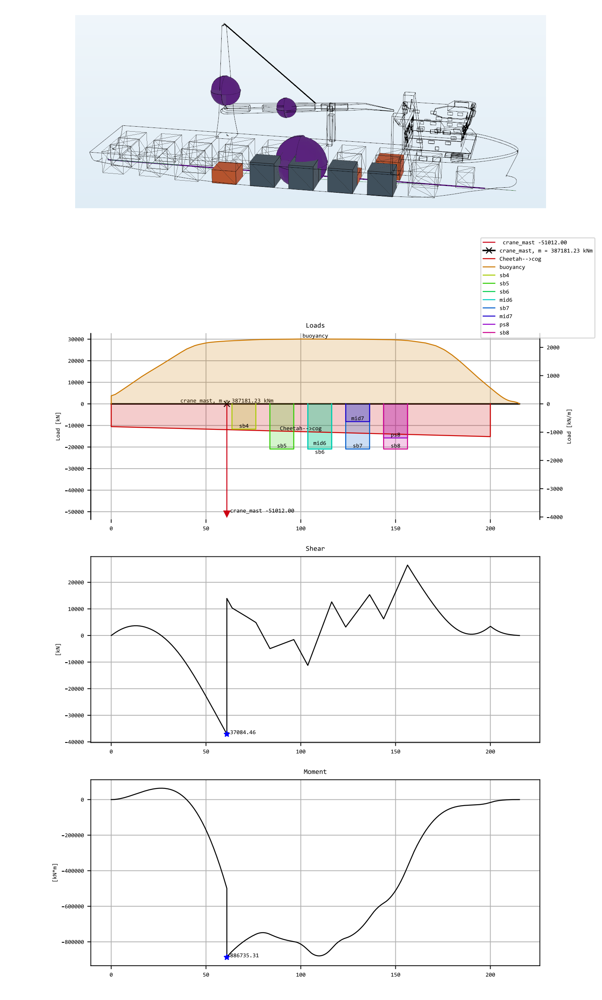
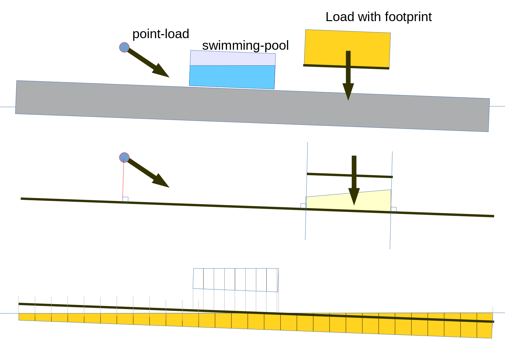

### Shearforce and bending moments

Calculation of the global bending moments and shear-forces in ships is an important part of checking the longitudinal or global strength of a vessel.

For this caluculation a ship is modelled as a single beam with forces acting on it. Typically these forces are cargo, self-weight, ballast and buoyancy.
In DAVE the global bending moments and shear-forces can be calulated for any axis system. Furthermore all loads from all nodes connected to that axis system will contribute to the shear and moment lines. This means that loads from cranes, grounding contact, trailered loads, pilelines are included.

For the calculation of the global shearforce and bending moments it is important to know at which location or over which length a force is distributed.

#### Where do loads connect?

DAVE distinguishes point loads and distributed loads. 

- Pointsloads are connected to the nearest point on the moment-line beam.
- Distributed loads are distributed over the portion of the beam bewteen the points on the beam closest to outer points of the distributed load.
- Loads from fluids (buoyancy, tanks) distributes over the area directly above/below it.

the subtle difference beteen the last two is that for normal distributed loads the imaginary line connecting the load and the beam runs perpendicular to the beam while for fluid loads it runs in vertical direction. The effect is that normal distributed loads may add an moment to the beam while fluids loads do not. The reason behind this difference is that otherwise shear and moment curves for vessels get jumps at segment intersections.

#### Point loads / distributed loads

Loads are loads resulting from forces on a point, connected axis systems or contact meshes. 

DAVE used the concept of "footprints" to define the area over which loads are distributed.
Footprints are a series of 3d points (vertices) that can be defined on any point or axis.

The projection of the footprints onto the plane in which the shearforce and moments are calculated determines the extent of the distributed load: so only the outer-most vertices in the current direction matter.
Points and axis nodes for which no footprints are defined result in point loads.

#### Self-weight

Self weight of RigidBodies is applied using the same footprint.

#### Connections, loads from child nodes

Each axis system applies its connection-force on its parent using its own footprint.
The connection force of an axis includes the loads of all child nodes. 

Footprints of nodes are only seen by the parent of a node.

### Implementation

RigidBodies, Axis and Points have a property "footprint". This is a list of vertices (3d).
- for axis: Defined in local axis system
- for point: Defined in parent axis system, relative to position of point
- for RigidBody: Defined in local axis system; use for self-weight as well.

references:
- DNVGL Rules for classification: Ships — DNVGL-RU-SHIP Pt.3 Ch.4.  https://rules.dnvgl.com/docs/pdf/dnvgl/ru-ship/2017-01/DNVGL-RU-SHIP-Pt3Ch4.pdf
