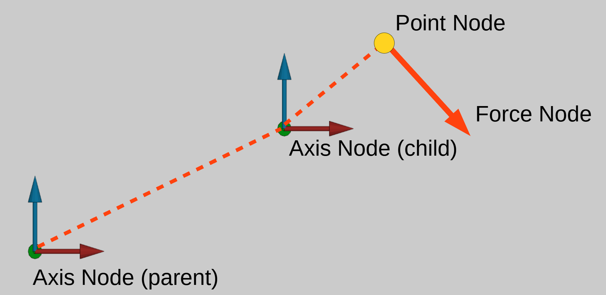
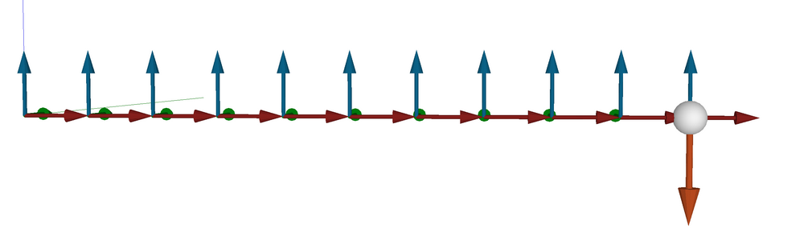
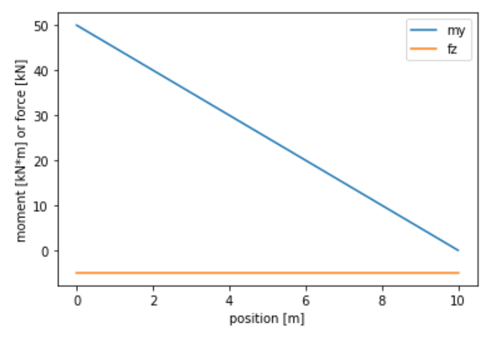

#### Forces

We have learned already that:

- The structure of the model consists of Axis type nodes
- Each of these nodes can have up to 6 degrees of freedom
- Axis nodes can be placed on other axis nodes

It is now time to explain how to obtain the forces that travel through the system.

First the list of nodes in the scene is sorted such that child nodes are in the list before their parents.
Then to the algorithm iterates over all the nodes in the list. For each node the forces are calcualted based on the current positions and orientations. The forces are then applied on the parent of the node.

Axis type nodes do not generate any forces by themselves. They may however receive forces from their children or other nodes. All these forces are summed up and are are stored in the axis node as "applied force".

```{admonition} Applied force
The applied force of an Axis node is the summation of all forces applied on that axis by its children and other nodes connected to that axis system.
```

The applied_force property has six components (Fx, Fy, Fz, Mx, My, Mz) representing the force and moment at the origin of the axis. The used coordinate system is the global axis system.

If the axis node has a parent, then the applied force is fed through to that parent. This is done only for degrees of freedom that are fixed. The force/moment applied on the parent is available as the "connection force".

```{admonition} Connection force
The connection_force of an Axis node is force/moment that is applied on its parent.
```

The connection_force property has six components (Fx, Fy, Fz, Mx, My, Mz) representing the force and moment at the origin of the axis. The used coordinate system is the *parent* axis system.


**Example**:

Consider de following example where the dotted orange lines indidate a parent-child relation:



The sorted list of nodes is: Force node, Point node, Axis node (child), Axis node (parent).

1. `Force node`: applies its force on the `point node`
2. `Point node`: applies the force that it received from the `force node` on its parent: `Axis node (child)`.
3. `Axis node (child)`: Has an 'applied force' force due to the contribution from the `point node`. This applied_force equals the force due the force-node as well as the moment due to the `force node` and the lever between the `axis node (child)` origin and the `point node`. If the global position of the point node is (px, pz), the global position of the Axis node (child) is cx, cz and the force in the force_node is fx, fz then the applied_force vector equals:
(Fx, 0 , Fz, 0, -(px-cx) * Fz + (pz-cz) * Fx, 0). This force and moment is then applied on the `Axis Node (parent)` via the 'Connection force'
4. `Axis node (parent)` has a applied force from the connection force of `Axis node (child)`. This force and moment act at the position of `axis node (child)`. Because `axis node (parent)` does not have a parent it is considered to be connected to the world. Its 'connection force' becomes the force/moment needed to counter the applied force. The force part of the connection force of `Axis node (parent)` is (-Fx, 0, -Fz). Assuming that the `Axis node (parent)` is located at the global origin, the moment part of the connection force is (0, px*Fz -pz * Fx, 0)

```{admonition} Force at location
*Connection force* and *applied force* represent the loads traveling through the construction at the origin of an Axis system node.
Clever placing of Axis systems in your model will give you the forces in your structure at the location and in the axis system that you need.
You can stack as many nodes as you want.
```

**Example**

In following model (ref notebook) a total number of 11 Axes are stacked from left to right. On the rightmost node a vertical force is applied:



The vertical force and y-moment in the axis nodes can then be used to obtain the moment and shear lines in this structure:



#### Degrees of freedom
In the previous examples we have assumed that all degrees of freedom were fixed. If all the degrees of freedom are fixed then the Axis is rigidly connected to its parent or the world. In that case the connection-force and the applied-load are exactly opposite.

If a degree of freedom is released then the connection force for that degree of is set to 0. 

```{admonition} Degrees of freedom and equilibrium error
The connection force is 0 for any free degree of freedom.

The difference between the applied_force and the connection_force is the equilibrium_error.
```

The difference between the `applied_force` and the `connection_force` is called the `equilibrium_error` and is expressed in the parent axis system. If the model is in static equilibrium then all equilibrium errors should be zero.

Solving static equilibrium will minimize the equilibrium_error by changing the degrees of freedom that are not fixed.


#### How the force in a cable is calculated

For a cable the distance bewteen the endpoints is obtained from the current geometry, this is then used to calculate the stretch, the stretch is combined with the stiffness to give the tension. The force due to the tension is then applied on the endpoints and intermediate points. In case of a cable these are Point or Circle type nodes.

The 2d and 6d connectors work similarly.

#### Axis and Points without a parent

Axis and Point type nodes do not need to have a parent. 
Points without a parent are considered to be fixed to the world.
Axes without parent are considered to be fixed to the world for any fixed degree of freedom.


