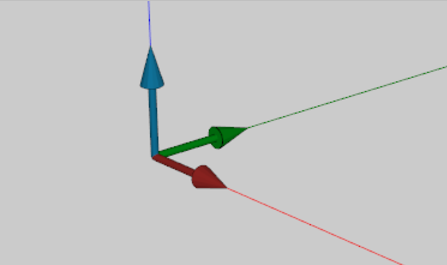
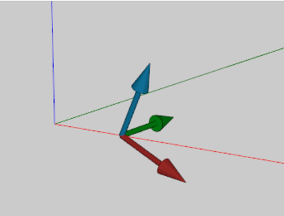
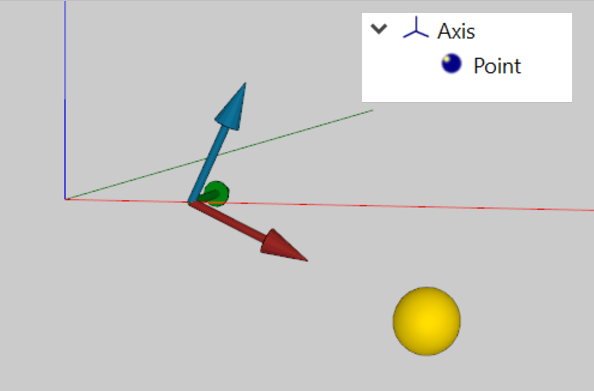
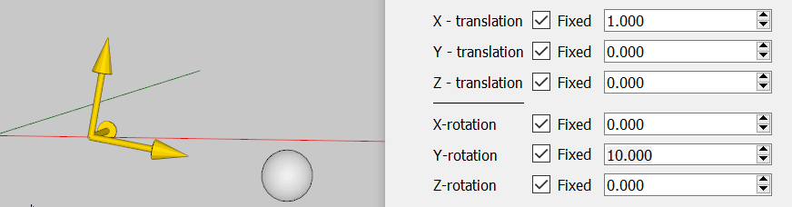
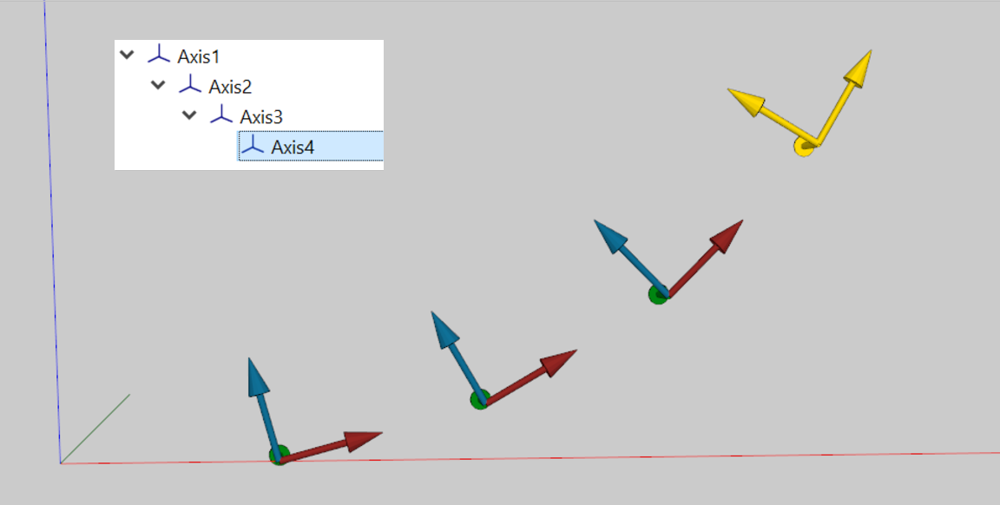
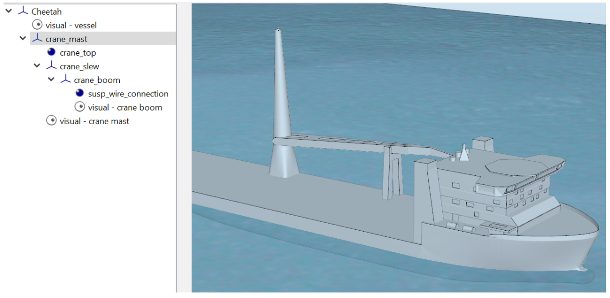
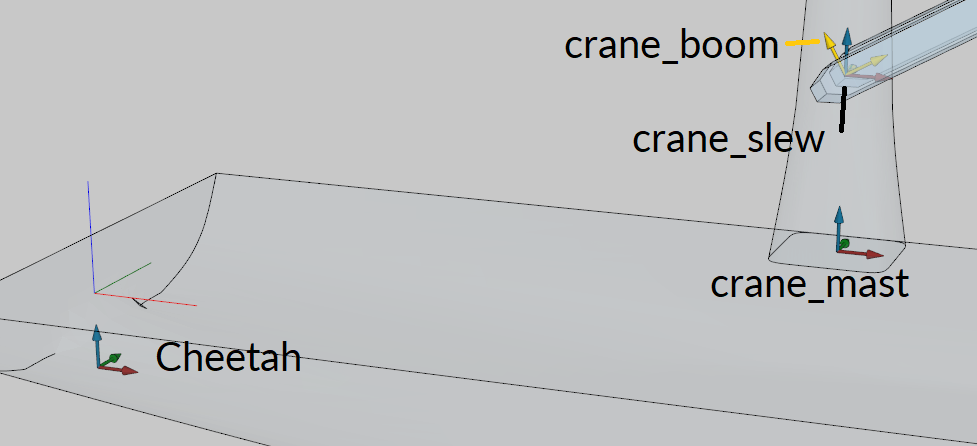
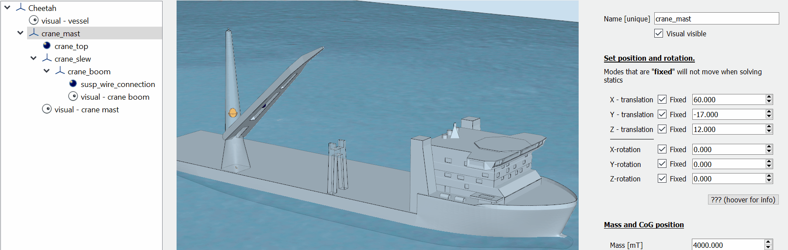
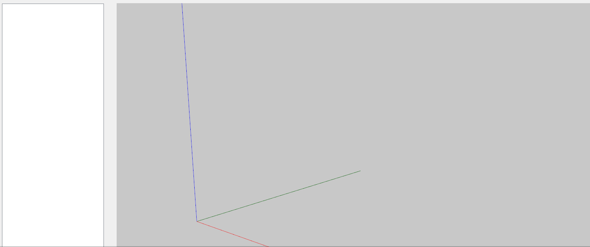

### Geometry

What can move and what can not? And which nodes move together?

All of this is defined using only a single type of node: Axis. Axis systems are the backbone of any model. 

To understand how DAVE works you need to understand the Axis node. So here we go.

An Axis system is a normal right-handed axis system with X, Y and Z directions. In visuals the X-axis is red, the Y axis is green and the Z axis is blue (RGB).

An axis system has a position and an orientation. This determines where the origin of the axis system is and how it is rotated. The following figure shows and axis system at X=1 [m] and rotated 25 [degrees] about the Y-axis relative to the global axis system (illustrated with lines).

Position and orientation are denoted as vectors: position = (1,0,0) and orientation =  (0,25,0).
First the position is applied and then the orientation. 

Other nodes can be placed “on” and axis system. Placing a node on an axis system means that this node becomes rigidly connected to that axis system. 

We call this a parent-child relation. If a node has a parent axis system, then the position and orientation of that node are defined based on that axis system. 

This this figure are point (the yellow sphere) is located on the Axis node at position (2,0,0). In DAVE terminology:
- the parent of ‘Point’ is ‘Axis’
- the position of ‘Point’ is (2,0,0)

The position of the point relative the to global axis system is called the “global position”. This is the position in the “world” and is what we see on the screen. This position is calculated by DAVE. In this case the global position of “Point” is x =  1 + 2 * cos(25) = 2.813 [m]=  y=0, z = 1 * sin(-25) = -0.845 [m]

The global position of “Point” will change when “Axis” is moved or rotated.

The cool thing is that axis systems can have a parent as well. This means that axis nodes can be stacked on top of each-other. This can be used to create more complex geometries.

The following figure shows four axis nodes: “Axis1”, “Axis2”, “Axis3” and “Axis4”. The parent of “Axis2” is “Axis1”, the parent of “Axis3” is “Axis2” and the parent of “Axis4” is “Axis3”. All of these nodes have a position of (2,0,0) and an orientation of (0,-15,0). This means that each axis system is shifted 2 [m] and rotated -15 [degrees] relative to its parent.

Where Point type nodes only had a global position, Axis type nodes have a global position as well as a global orientation. Again this global orientation is calculated by DAVE based on the orientation of the node and the orientation of its parent. The global orientation of “Axis1” is (0,-15,0). The global orientation of “Axis2” is (0,-30,0). The global orientation of “Axis3” is (0, -45, 0) and the global orientation of “Axis4” is (0,-60, 0).

So how could this be used in practice?

Consider the model of the Cheetah with crane. 

This model contains the following stacked axis system nodes:
- Cheetah
   - crane_mast
      - crane_slew
         - crane_boom

Moving the cheetah will move the crane with it. Moving the crane mast will move the crane slew and boom with it. Rotating the crane_slew will move the crane_boom with it and moving the crane_boom will only move the crane_boom.

Obviously multiple nodes can share the same parent. So for example placing a cargo item on the Cheetah is no problem. The cargo would be an axis system node with Cheetah as parent. In that case “crane_mast” and “cargo” would both can “Cheetah” as parent.

This section showed how Axis system can be used to define how nodes are connected to each-other.

#### Gui

At this moment it is a good idea to play a bit with the graphical user interface.

New axis system can be created by right clicking on the viewport.

An axis system can be edited by selecting it (left click) in either the viewport or the node-tree. This will bring up the node-editor.

The parent of an axis (or any other node) can be changed by dragging and dropping it in the node-tree.
Note that when a parent is changed using the Gui the node will maintain its global position. 

The next section will introduce how to define the degrees of freedom of a model.