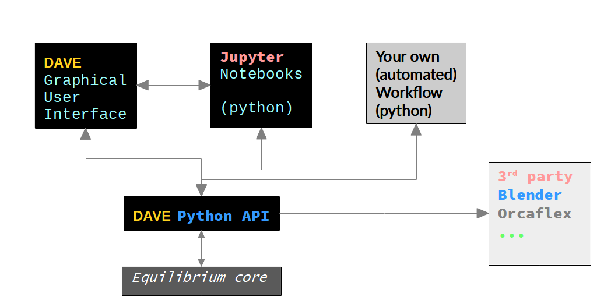

# Getting started

## How to use DAVE

DAVE is not a single program. It is a number of components that work together with already exiting tools. In that sense it is more of a framework. Depending on what you want to do with it you may end up using it in different ways.

The core parts of DAVE are the python API and the equilibrium core. These two form the engine of the system and take care of all the number-crunshing, bookkeeping, solving and all the other things that occur behind the scenes.

### The graphical user interface

The DAVE graphical user interface is an interface around the DAVE python API and provides an good way to create and modify DAVE models. If you are new to DAVE then this is what you want to start. 

### Jupyter notebooks

The big drawback of graphical user interfaces is that they do not document your workflow. So when a report is needed you basically need to document every button you pushed and every number you entered.
Enter Jupyer Notebooks. Jupyter notebooks allow you script your models using the popular python language. But these are not scripts like the plain text files from the 80s. These scripts have formatting, images, graphs, 3d renders of your model, report tables. In fact the manual that you are reading now is a jupyter notebook.

### Your own (automated) workflow

Maybe you just want to use DAVE as part of a larger piece of software. Or you want to call some of DAVEs functions from your python scripts. Can do. As long as your workflow can speak python.
DAVE can run on both windows and linux. So if you want to use it on a linux server, please go ahead.

### Some things already exist

There is no need to re-invent the wheel. There are already good time-domain simulators, 3D drawing packages and 3d renderers. It is not the mission of DAVE to provide a free alternative for package you-name-it. Instead of including these functions in DAVE, DAVE strives to provide export interfaces to these programs.
