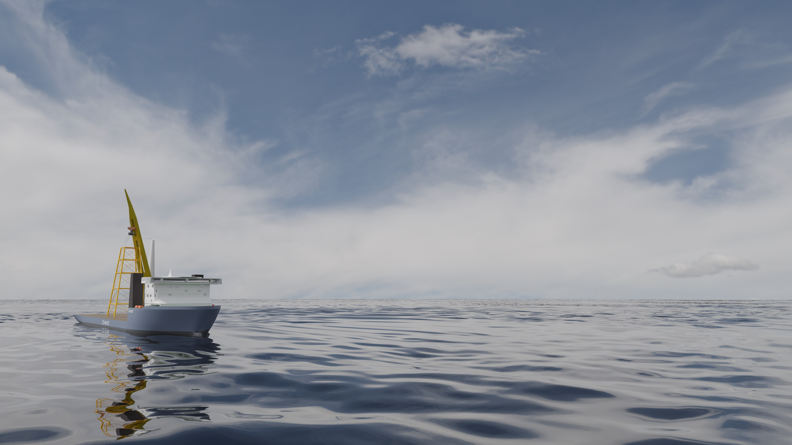

# Introduction

DAVE stands for Design Analysis Visualization Engineering.

It is a software framework that helps to design marine operations in a visual yet accurate way. DAVE can do rigging design as well as hydrostatics and rendering and dynamics.

Its mission is:

**To make engineering better, faster and more fun by making it easier and more visual while maintaining the accuracy and quality.**

Models in DAVE can be created using re-usable standard building blocks. Once created a model can be analyzed statically or in frequency domain. This is excellent for engineering of static equilibrium problems such as rigging analysis, hydrostatic stability, barge moorings and heavy lifts.

DAVE can also be used for rapid prototyping of operations. The visualization makes it easy for multi-disciplinary teams to explore opportunities while at the same time it offers a quick way to check the feasibility of operation in terms of stability and natural periods. It is a simulation center on your desktop.

If further dynamic analysis or visualization is required then the created models can be exported to other software packages. No need to transfer information manually.

DAVE is partially written in Python. The python parts are open-source and can be used under the MPL 2.0 license. This means DAVE can easily be included in any automated workflow.

The core where the calculations are performed is a commercial and closed-source component. This component can be used for free for educational, non-commercial and evaluation purposes. Commercial support is available if needed.

