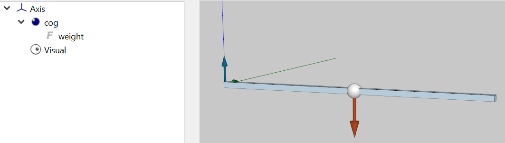
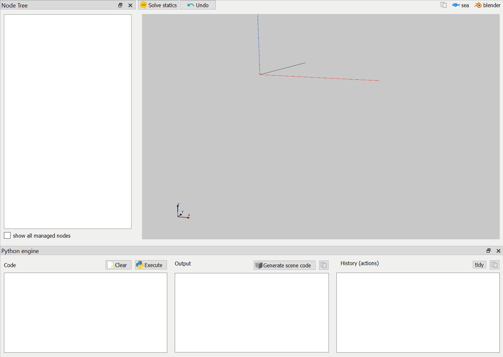
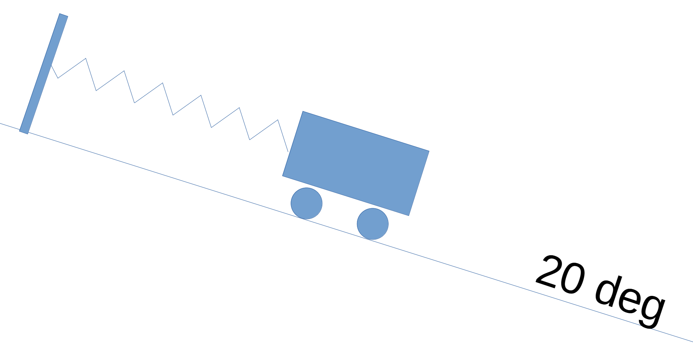
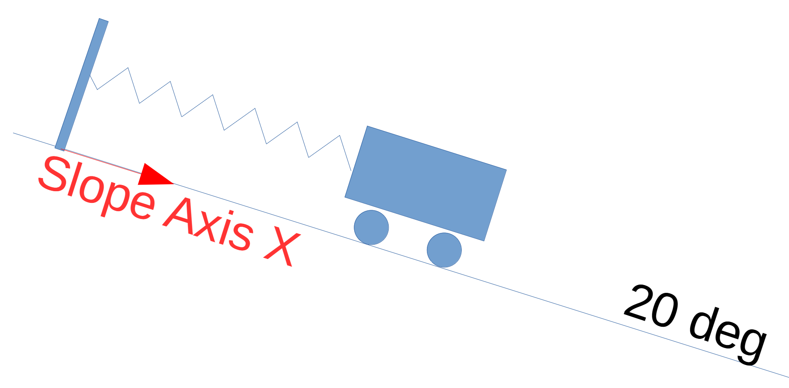
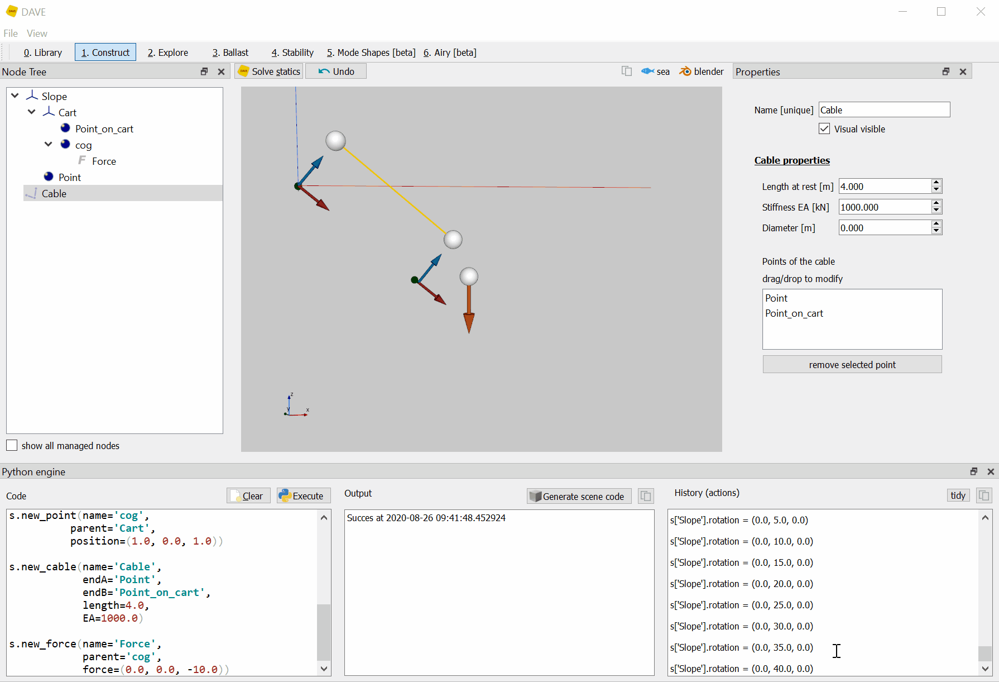

# Joints

Joints are connections between bodies that allow certain movements and prohibit others. For example a hinge, ball-joint or slider. Some software packages use joints nodes or elements to model joints.  *DAVE does not need a dedicated joint node.*

To model a joint in DAVE it is sufficient to release the relevant degree of freedom of a Frame.

Examples:
- to model a slider in x-direction : release only the X position
- to model a ball-joint: release all rotational degrees of freedom
- to model a hinge: release a single rotational degree of freedom 


But how to model a slider in a direction that it not x,y or z? The solution is simple. Stack the partially released axis on another axis and rotate that second axis such that one of the main directions of the partially released axis points in the right direction. This is illustrated in the second example below.

## Example: hinging bar

The following example models a bar connected to a hinge.



- The bar is a Frame node
- The cog of the bar is modelled by placing a Point on the bar (the parent of 'cog' is 'bar')
- Gravity is modelled by applying a force node on the cog with a downward force of 1000 kN (the parent for 'weight' is 'cog')
- A visual is added just because we can


You can create this model by copy-pasting the following python code into the Gui and executing it.



```python

s.new_frame(name='Axis',
           fixed =(True, True, True, True, False, True) )

s.new_point(name='cog',
          parent='Axis',
          position=(5.0,
                    0.0,
                    0.0))

s.new_visual(name='Visual',
            parent='Axis',
            path=r'cube.obj',
            offset=(5.0, 0.0, 0.0), 
            rotation=(0, 0, 0), 
            scale=(10.0, 0.2, 0.2) )

s.new_force(name='weight',
            parent='cog',
            force=(0.0, 0.0, -1000.0),
            moment=(0.0, 0.0, 0.0) )
```

In this example the hinge is modelled by releasing the Y-rotation of the beam.


## Example: cart on hill (inclined slider)

This example illustrates how to model a slider under an angle. 



Consider a cart on a slope. The cart can move up and down along the slope, so it makes sense to model this as a slider in the direction of the slope.
The key of doing this in DAVE is to introduce a dedicated frame node for the slope. This frame can then be aligned with the slope by changing its orientation to (0,20,0).



The cart can now be modelled as a child of the slope frame. This means that the position of the cart is defined relative to the slope. Freeing the X-position of the cart enables it to move along the slope.


You can create this model by copy-pasting the following python code into the Gui and executing it.



```python

s.new_frame(name='Slope',
           rotation=(0.0,
                     20.0,
                     0.0) )

s.new_frame(name='Cart',
           parent='Slope',
           fixed =(False, True, True, True, True, True) )

s.new_point(name='Point',
          parent='Slope',
          position=(0.0,0.0,1.5))

s.new_point(name='Point_on_cart',
          parent='Cart',
          position=(0.0,0.0,1.5))

s.new_point(name='cog',
          parent='Cart',
          position=(1.0, 0.0, 1.0))

s.new_cable(name='Cable',
            endA='Point',
            endB='Point_on_cart',
            length=4.0,
            EA=10.0)

s.new_force(name='Force',
            parent='cog',
            force=(0.0, 0.0, -10.0))

```

## Further investigation:

For self-study:

- Free the rotation of the cart about its Y-axis and solve statics. Does the result make sense?
- Free the rotation of the slope about its Y-axis and solve statics. Does the result make sense?


