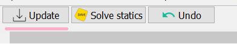

## The Gui

While in a python script, the graphical userinterface can be lauched to manually view or modify a scene. This can be done by importing the Gui class from DAVE.gui and constructing an instance of it with a Scene as parameter:

```python
from DAVE import *
s = Scene()


from DAVE.gui import Gui
Gui(s)
```

This will create a qt application or use the existing QApplication instance if one is available.
Practically this means that if you are running this code from an interactive prompt such as ipython, spyder or a jupyter notebook then this program will be blocked until the gui is closed again.

If you want to have the gui and an interactive python interpreter running side by side then do the following:

```python
%gui qt
Gui(s, block=False)
```

The first command tells ipython to integrate the qt event-loop. The block=False parameter tells DAVE to do the same. 

```{admonition} Example:
When working with the non-blocking GUI there are TWO programs that interface with the SAME SCENE. That means that if you create a node using the Gui and then try to run the generated code in the interpreter you will get an error because that node already exists.
```

The gui is not automatically updated when the scene is changed from the python interface. There is a button:

 that you can press to update the gui to reflect the current state of the model.
