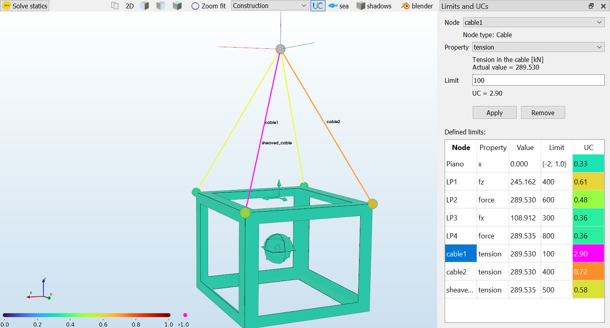

# Limits and unity-checks

Limits can be defined on any property of any node.

There are two types of limits:

1. Absolute limit
2. Range limit

An absolute limit compares the absolute value of the property to the limit. The UC then
becomes:

```
UC = |value| / limit
```

A range limit defines a (min, max) for a value. In that case the UC is calculated as the distance of the value
from the center of the range. The closer the value is to the edge of the range, the higher the UC.

```
UC = |(value-mid) / 0.5*(max-min)|

where mid = mean(max, min)
```

In the GUI the limits can be defined in the "limits" view:



Programatically every node has a "limits" dictionary. The keys in this dictionary correspond to
property names. The corresponding values are float (for an absolute limit) or a 2-sized tuple for a range.