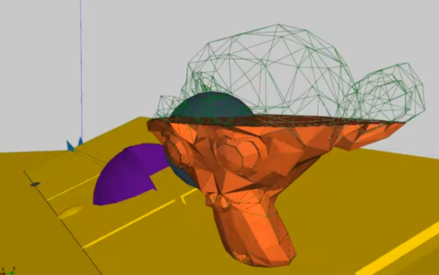
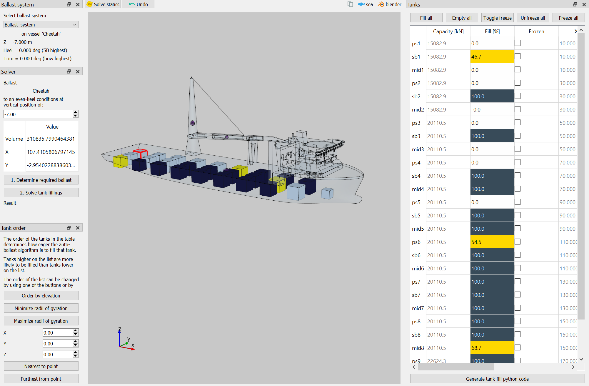
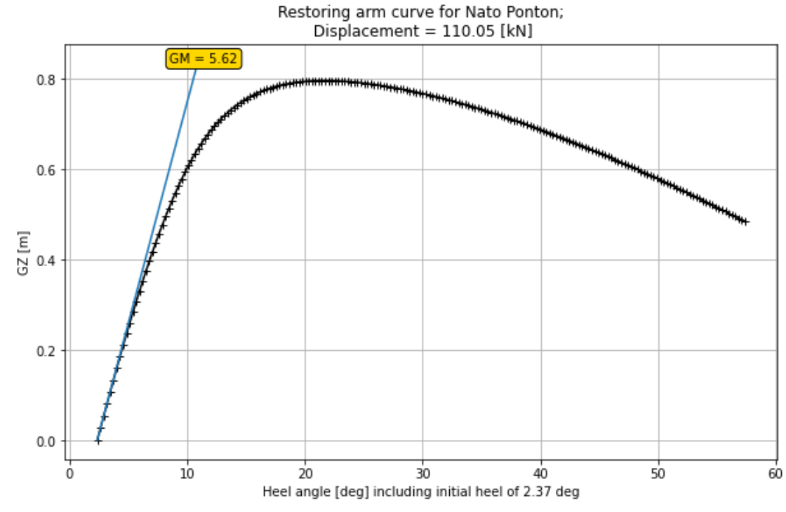

## Marine calculations

DAVE supports marine calculations by including

1. A linear buoyancy node
2. A buoyancy mesh node
3. A tank mesh node
4. A ballast system node

### The linear buoyancy node

The linear buoyancy node provides a way to model linearized buoyancy. This is buoayncy based on a stiffness matrix like used by (for example) orcaflex or marin .hyd files.
A linear buoyancy mode can be created from a buoayncy mesh or by manually providing the hydrostatic properties for that draft.

### Buoyancy mesh node

The buoyancy mesh node provides shaped based buoyancy. Just provide a panel mesh and it will float. Shapes can be provided in .obj or .stl format and can be shifted, scaled and rotated if required.

```{admonition} Blog post
The blog post about stability use the shaped based buoyancy:
See [open-ocean](https://www.open-ocean.org/vessel-stability/)
```

```{admonition} Buoyancy mesh vs diffraction mesh
The buoyancy mesh is used only to provide the shape. There is no need for smooth panel size distributions like the requirements for diffraction models. Modelling large flat surfaces with a single panel is excellent.
```

A small self check or this node can be found here:
[Hydrostatics of a rectangular barge](https://github.com/RubendeBruin/DAVE-notebooks/blob/master/validation/hydrostatics/hydrostatic%20rectangular%20barge.ipynb)


### Tank mesh node

This is basically a buoyancy node but then with fluid on the inside instead of the outside. Define a shape and an amount of fluid inside it and DAVE will calculate the position of the fluid.

The following image shows a suzanne (Blender's mascot) shaped tank which is partially filled.




```{admonition} Blog post
See [open-ocean: vessel stability 1](https://www.open-ocean.org/release-1-4-tanks-and-thanks/)
```


### Ballast system node

Determining a ballast condition can take a lot of time. DAVE has an algorithm for that.

DAVE can calculate the required amount of ballast and the horizontal position to reach a certain draft at even keel. This includes cargo and other objects in the model that influence the vessel.
This amount of ballast can then be distributed automatically over a number of defined tanks, taking into consideration that we want to have as few slack tanks as possible.

It is also possible to provide a priority in which the tanks should be filled. This can be used to optimize the dynamic behaviour of the vessel by minimizing or maximizing the radii of gyration. Or to optimize the stability by ballasting the lowest tanks first.



Manual tank filling is also possible.


### Carene tables

A carene table can be generated from a shape-based buoayncy node using the `carene_table` function.
{doc}`Carene Table Notebook<DAVE-notebooks/Carene Table>`

### Stability calculations [GM curves]

With the tank and buoyancy nodes in combination with the static equilibrium solver it is possible to compute GM curves for pretty much anything. 
- Single ships, 
- ships with buoyant cargo, 
- barges lifting something, 
- dual crane lifts, 
- dual vessel lifts,
- lifts with one end of the cargo still on the quay side,
- ...

Options also include free trimming.

```{admonition} Blog post
See [open-ocean: vessel stability 2](https://www.open-ocean.org/vessel-stability-2/)
```




### Validations

- GM curve calculation in combination with shape based buoyancy and shape based tanks were cross-validated against GHS.
Follow this link for the notebook: [GitHub](https://github.com/RubendeBruin/DAVE-notebooks/blob/master/validation/hydrostatics/GHS/Nato%20pontoon%20with%20partially%20filled%20tanks.ipynb)


- Hydrostatics for a ship-shaped model were compared against DELFTship:
Follow this link for the notebook: [GitHub](https://github.com/RubendeBruin/DAVE-notebooks/blob/master/validation/hydrostatics/DELFTship/DELFTship%20model%201.ipynb)


