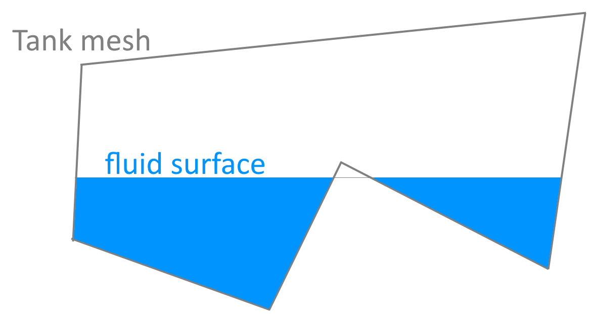
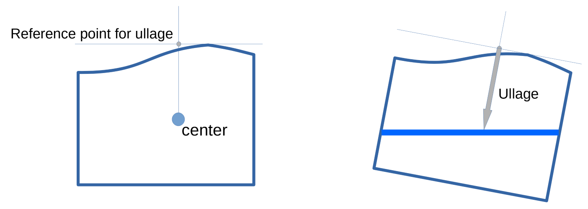

# Tank

The `Tank` node models a mesh containing a fluid such as a ballast-tank or a cargo-tank. Alternatively they can also
be used to model caveties in a floating body.

The geometry of a tank is defined by a mesh. The definition of the mesh is exactly the same as for `Buoyancy` nodes.

The **capacity** of the tank [m3] is defined by the volume enclosed by the mesh and the **permeability** [-]. The amount of fluid
in a tank can be defined as **volume** [m3] or as **fill percentage**.

The fluid in the tank will fill all of the inside of the tank up till an automatically determined elevation. For tanks 
with physical sections this means that fluid will be distributed over both sections:

The fluid surface is always horizontal. This means that the fluid will re-distribute if the orientation of the tank changes.
During stability (GM) calculations this re-distribution is used as well. This results in a more accurate approach of the stability
curves than when using the free-fluid surface correction.

The **density** of the fluid in the tank can either be defined [mT/m3] or can be set to be equal to the density of the water
in the rest of the scene.

Damaged tanks can be modelled by setting the tank to **free-flooding**. In that case the density of the fluid in the tank is
set to the density of the water in the scene and the fluid surface elevation equals the global fluid elevation.

**Ullage** of the tank [m] is calculated from the tank geometry and the fluid surface elevation. This is done as follows:

For zero inclination (left): 
1. determine the geometrical center of the tank
2. determine the highest point of the tank
3. define the ullage reference point as the combination of these two.

For any inclination (right) the ullage is now the distance from the ullage reference point to the fluid surface measured 
in the original vertical direction of the tank (local z direction). Except if it exceeds the depth of the tank. In that case the ullage is equal to the depth of the tank.

When calculating **shear and bending moments** the fluid in the tank is discretized into slices perpendicular to the direction
of the axis over which the shear and bending is calculated. Each of the slices then adds a distributed force over the 
thickness of the slice with the total force acting at the center of fluid of that slice. So fluid re-distribution is
fully accounted for in shear and bending moment diagrams as well.

## Tank-API
Tank provides a fillable tank based on a mesh. The mesh is triangulated and chopped at the instantaneous flat fluid surface. Gravity is applied as an downwards force that the center of fluid.
    The calculation of fluid volume and center is as accurate as the provided geometry.

    There as no restrictions to the size or aspect ratio of the panels. It is excellent to model as box using 6 faces. Using smaller panels has a negative effect on performance.
    
    The normals of the panels should point *away* from the fluid. This means that the same basic shapes can be used for both buoyancy and tanks.

|  Property | Read-Only  | Documentation 
|:---------------- |:------------------------------- |:---------------- |
trimesh | Read-only | |
free_flooding |  | |
permeability |  | Permeability is the fraction of the enclosed volume that can be filled with fluid [-]|
cog | Read-only | Returns the GLOBAL position of the center of volume / gravity|
cog_local | Read-only | Returns the local position of the center of gravity|
cog_when_full | Read-only | Returns the LOCAL position of the center of volume / gravity of the tank when it is filled|
fill_pct |  | Amount of volume in tank as percentage of capacity [%]|
level_global |  | The fluid plane elevation in the global axis system. Setting this adjusts the volume|
volume |  | The volume of fluid in the tank in m3. Setting this adjusts the fluid level|
density |  | Density of the fluid in the tank in mT/m3|
capacity | Read-only | Returns the capacity of the tank in m3. This is calculated from the defined geometry.|
ullage | Read-only | Ullage of the tank [m].         The ullage is the distance between a measurement point and the fluid surface. The point is [xf,yf,zv] where         xf and yf are the x and y coordinates (local) of the center of fluid when the tank is full. zv is the largest z value         of all the vertices of the tank.         The measurement direction is in local z-direction. If the tank is under an angle then this is not perpendicular to the fluid.