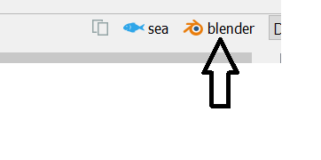

## Rendering

Blender can be used for world-class rendering. It is completely free and can be obtained from [blender](https://www.blender.org/)

Once blender is installed a scene can be exported to blender directly by pressing the cute blender icon:



When an animation is running then this will export the animation. Otherwise it will export the view.

### The Base Scene

The Blender model starts with the blender base model that is included with DAVE.

By default this is a file called "base ocean.blend" which is located in the highest resource path.

The base scene contains 
- the sea, 
- the sky, 
- a material called "Cable" which is used for exported cables and 
- a material called "Ocean" which is used for exported waves

It is possible to start with another base scene. This can be changed by either:
- passing another file-name as argument to the `create_blend` or `create_blend_and_open` functions
- changing the `BLENDER_BASE_SCENE` variable (defined in settings.py)

### Assets

All visuals are exported to Blender. All visuals in DAVE are either .obj or .stl files.

During the export DAVE looks for a file with the same name but with the .blend extension. If such a file is found through the resources system then that file is imported. If such a file is not found then the .obj or .stl is used.

This means that for a workflow with a nicely rendered result it is advised to
1. create your visuals in blender
2. apply all transforms by hitting A (select all) and then Ctrl+A --> All Transforms
3. keep the high resolution blender file with shaders, textures, etc. somewhere in a resource path
4. export a lower resolution .obj for use in DAVE. Use Y forward and Z up during export.


```{admonition} Blog
https://www.open-ocean.org/meshing-with-blender/
```

