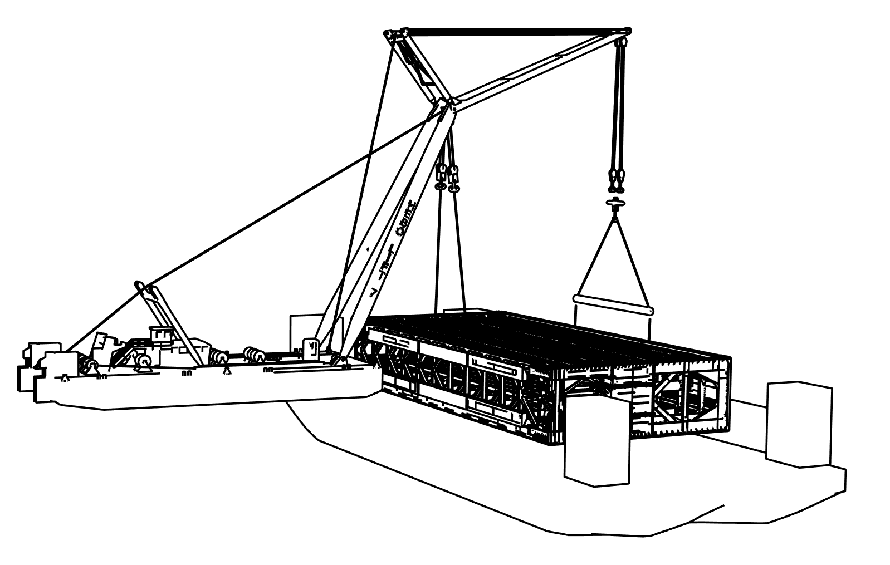
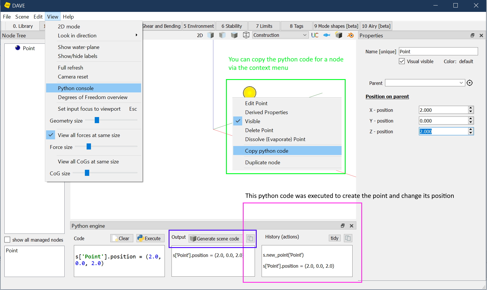
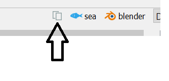

# Reporting

Designing something awesome is fun. But there comes a time when you need to report and document what you did and how you did it. 

|  |  |
| -------------------------------------- | -------------------------------------- |

*Examples of DAVE output*

A good report contains at least the following sections:

| Section                                                      | How can DAVE help you                                        |
| ------------------------------------------------------------ | ------------------------------------------------------------ |
| Introduction, Purpose and Scope                              | Sorry, you need to do this yourself                          |
| Input<br>Contains all the data that is used for an analysis including references | - Use jupyter notebooks for documenting the creation of a DAVE model.<br>- Limit required data using pre-made model via "import", `Components` or `SuperNodes`.<br>- Node-tables and node-properties sections in .pdf reports<br>- Use 3d images or renders to show the model(s) |
| Analysis methods<br>DAVE automated analysis is documented online and freely available. | Include a .pdf version of the DAVE analysis documentation in an appendix or refer to the online documentation. |
| Results<br>                                                  | - Running a standard DAVE analysis will produce a .pdf report  containing all relevant information.<br> |
| Drawings, sketches, 3d models and animations.                | - Time-line can be used to export animations.<br>- Models can be exported to many formats (including 3d dxf) from Blender. |


## Documenting the input

Quality control procedures often require a second person to check that all the input that was used for a calculation is correct.

This is often one of the weak points of programs with a GUI. They can produce large tables and reports with data, but it is very hard to distinguish between data that you entered, data that was solved and data that was already there. This can make check-printing somebodies work nearly impossible.

DAVE solves this by using python as file-format.

- DAVE can be run from Jupyter.  This means a model can be constructed using a jupyter workbook. Including running an analysis and writing the results to a .pdf report. This makes a good way to document what information is going into a model.
- .DAVE files can contain python code, including comments. Skilled engineers can use this to limit the amount of input.

This way of working is possible because every action in the DAVE GUI has a corresponding python command. These command can be entered directly in a jupyter notebook to re-create your model. This allows you to document the process rather than the resulting model. It is a bit like recording a macro in excel but then 30 years into the future.

:::{tip}

DAVE helps to generate python code required to make a model in various ways:

1. Python code for a node can be obtained directly via the context menu.
2. The commands reflecting the actions performed via the GUI can be copy-pasted from the python console in the GUI. The python console can be shown in the GUI using view --> python console.
3. Python code for the complete model can be generated using the "Generate scene code" button




:::

The Jupyter interface of DAVE provides the following options to document and illustrate the model:

```python
from DAVE.jupyter import *
```

|  Function | Does|
|:---------------- |:------------------------------- |
| show(s)           | creates a static 3D image of the model |
| report(node)      | reports all properties of that node |
| report(node, x )  | reports only property x of node |
| s.print_node_tree() | display of all nodes in the scene |

A small present for those who read the manual:


This button copies the code to include the current 3D view into jupyter.

It is also possible to open the Gui from the notebook.

```python
from DAVE.gui import Gui
Gui(s)

# This opens the current Scene (s) in the GUI
```


And of course you can leverage all existing jupyter and python functionality such as pandas, matplotlib, pdf export etc.

## Notebooks
 {doc}`Reporting demonstrations<DAVE-notebooks/Reporting node properties>`

