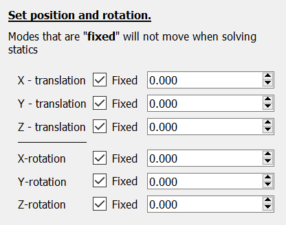

### Solving static equilibrium

We have now covered how to create the structure (tree) of a model and how to decorate it with nodes. Time to move to the static solver.

DAVE's static solver tries to bring the model to a state with force and moment equilibrium. But what is the "state"? Which parts of the model can move and how can they move?
The way the in which that Axis nodes in the model are allowed to move is defined by the "degrees of freedom" of the model. This is defined for each Axis element in the model.

```{admonition} Degrees of Freedom
The solver finds the numerical values for the positions and orientations of axis nodes that are not fixed
```

By default the position and orientation of an axis node are fixed. 



The position and orientation of each and every Axis in the model is defined using six numbers. Three for the position and three for the orientation. Each of these six components can be either "fixed" or "free" (not fixed). Any free component becomes a degree of freedom of the model. The numerical values for these degrees of freedom will be determined by the static equilibrium solver.

#### Example


```

s.clear()

# code for sky_hook
s.new_point(name='sky_hook',
          position=(2.0,
                    1.0,
                    4.0))
# code for Piano
s.new_axis(name='Piano',
           position=(0.0,
                     0.0,
                     0.0),
           rotation=(0.0,
                     0.0,
                     0.0),
           fixed =(True, True, True, True, True, True) )
# code for liftpoint
s.new_point(name='liftpoint',
          parent='Piano',
          position=(1.0,
                    1.0,
                    0.0))
# code for center of gravity
s.new_point(name='center of gravity',
          parent='Piano',
          position=(0.0,
                    0.0,
                    0.0))
# code for Cable
s.new_cable(name='Cable',
            endA='liftpoint',
            endB='sky_hook',
            length=5.0,
            EA=10000.0)
# code for Force
s.new_force(name='Force',
            parent='center of gravity',
            force=(0.0, 0.0, -3.0),
            moment=(0.0, 0.0, 0.0) )
```