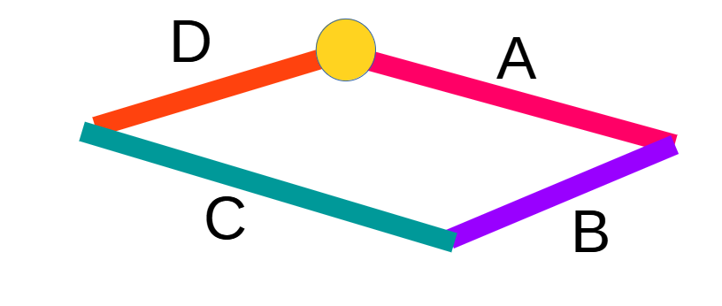

## Trees and Loops

Joints in DAVE are mathematically perfect. This has one big disadvantage: It is impossible to construct geometric loops in a structure. This is because a child can not be its own (grand) parent.
This is not unique to DAVE. Any software implementing multibody structures (Orcaflex constraints, bullet physics multibody) suffers from this.


### Work-around 1: Elastic connectors

This becomes an issue for example when attempting to construct a truss structure such as a lift-frame using geometry. 



One can place B on A, C on B and D on C. But A can not be placed on D.

```
A
|-- B
    |-- C
        |-- D
```         

The work-around in this case is to connect D to A by creating a stiff 6D or 2D connector. (Or, even better, model the corners as Axes nodes and create linear beam between them).

### Work-around 2: Re-ordering

You may also run into this restiction when you need to create a fixed connection between two standard assets. The connection may need to be made between two items that are already some other nodes child. For example you have a wind-turbine with a shackle on top. The shackle is a child of the wind-turbine.
You want to connect this to some kind of clever lifting device on a vessel. The clever-lifting-device is a child of the vessel. 


```
Vessel
|--- Clever lifting device

Wind-turbine
|---- Shackle
```

In this case it may be possible invert the parent-child relation of the wind-turbine/shackle such that the shackle becomes the parent and the turbine becomes the child:

```
Vessel
|--- Clever lifting device
     |--- Shackle
          |---- Wind-turbine
```

```{admonition} General tip
It is good practice make the largest item the parent.
- Crane on a ship: Ship as parent, crane as child.
- Padeye on a structure: Structure as parent, padeye as child
```